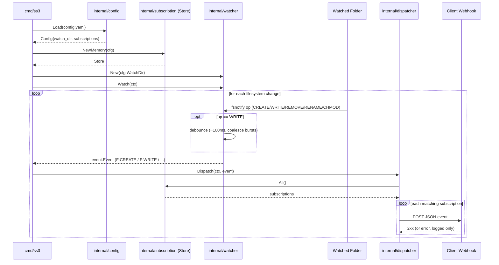

# Architecture

`ss3` watches a single folder for filesystem changes and POSTs a JSON
notification to every subscribed webhook URL, mimicking S3 bucket
notifications.

## Components

- **`internal/config`** — loads `config.yaml`: the folder to watch
  (`watch_dir`) and a static list of webhook subscriptions, each with a URL
  and the set of event names it wants (`CREATE`, `WRITE`, `REMOVE`,
  `RENAME`, `CHMOD`). Validates the file at startup and maps event names to
  their `event.Type` (adding the `F:` prefix).

- **`internal/event`** — defines `event.Type` (`F:CREATE`, `F:WRITE`,
  `F:REMOVE`, `F:RENAME`, `F:CHMOD` — one per fsnotify op) and the
  `event.Event` JSON payload (`id`, `event`, `path`, `size`, `timestamp`).
  IDs are UUIDs (`github.com/google/uuid`).

- **`internal/watcher`** — wraps `github.com/fsnotify/fsnotify`, watching
  `watch_dir` non-recursively. Maps each fsnotify op straight to its
  matching `event.Type` and debounces bursts of `Write` events per path
  (~100ms) so a single file save produces one `F:WRITE` notification.

- **`internal/subscription`** — `Subscription` (a URL plus the event types
  it wants) and a `Store` interface. `Memory` is the phase-1 in-memory
  implementation, built once from config at startup; a later phase can swap
  in a SQLite-backed `Store` without touching the dispatcher.

- **`internal/dispatcher`** — for each event, looks up matching
  subscriptions and POSTs the JSON payload to each one, fire-and-forget
  (no retries in phase 1; failures are logged).

- **`cmd/ss3`** — entrypoint: loads config, wires the store, watcher, and
  dispatcher together, and runs until `SIGINT`/`SIGTERM`.
